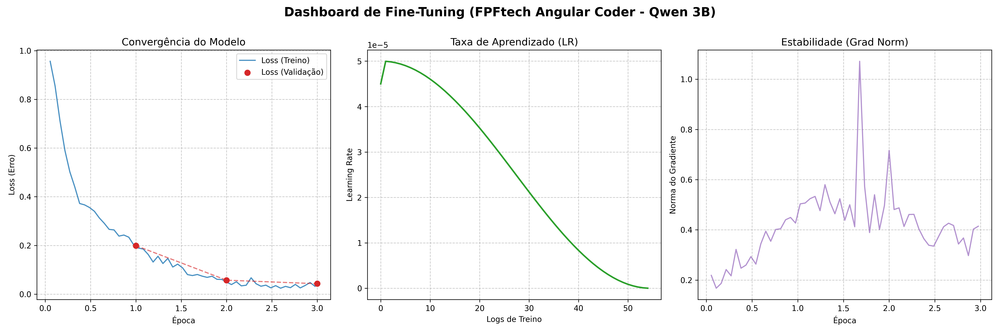

# 📊 Relatório de Comparação: Modelo Base vs Fine-Tuned

Este relatório apresenta as respostas geradas pelo modelo original e pelo modelo treinado para fins de auditoria técnica.

## 📈 Visualização de Métricas (Dashboard)


---

## Exemplo 1
**Prompt:** `Crie um componente Angular para listar empresas com paginação`

### �� Modelo BASE
```typescript
import { Component } from '@angular/core';
import { FormBuilder, FormGroup } from '@angular/forms';
import { Router } from '@angular/router';
import { Observable } from 'rxjs';

// Importações dos seus serviços aqui

@Component({
  selector: 'app-list-empresas',
  templateUrl: './list-empresas.component.html',
  styleUrls: ['./list-empresas.component.css']
})
export class ListEmpresasComponent extends BaseComponent<IEmpresa> {

  formGroup!: FormGroup;
  page = 1;
  pageSize = 10;

  constructor(
    private fb: FormBuilder,
    private toastService: ToastService,
    private translateService: TranslateService,
    private empresaService: EmpresaService,
    private router: Router,
    injector: Injector,
    options?: any
  ) {
    super(injector, options);
  }

  ngOnInit(): void {
    this.createFormGroup();
    this.loadEmpresas();
  }

  createFormGroup(): void {
    this.formGroup = this.fb.group({
      search: ''
    });
  }

  loadEmpresas(page = 1, pageSize = 10): void {
    const params = {
      page,
      pageSize,
      search: this.formGroup.get('search')?.value || ''
    };

    this.empresaService.list(params)
      .subscribe((response) => {
        // Atualiza a lista de empresas ou realiza outras operações necessárias
      }, error => {
        this.toastService.error(this.translateService.instant('error.loading'));
      });
  }

  onSearchChange(event: Event): void {
    if ((event.target as HTMLInputElement).value.trim()) {
      this.page = 1; // Reinicia a página quando há busca
    }
    this.loadEmpresas();
  }

  onPageChange(page: number): void {
    this.page = page;
    this.loadEmpresas(page, this.pageSize);
  }

  onPageSizeChange(size: number): void {
    this.pageSize = size;
    this.loadEmpresas(1, size);
  }
}
```

Este componente `ListEmpresasComponent` estende `BaseComponent`, que deve ser definido em seu projeto como uma classe base para todos os componentes do sistema. Ele inclui funcionalidades básicas para listagem de empresas com paginação:

1. **Formulário**: Um formulário básico para buscar empresas.
2. **Paginação**: Suporte para navegar entre páginas e alterar o tamanho da página.
3. **Carregamento das Empresas**: Usa o serviço `EmpresaService` para carregar empresas paginadas com base nas opções fornecidas.

Certifique-se de substituir `IEmpresa`, `ToastService`, `TranslateService`, `EmpresaService`, etc., pelos tipos e serviços específicos do seu projeto.

### 🟢 Modelo FINE-TUNED
```typescript
import { Component, Injector, OnInit } from '@angular/core';
import { BaseComponent } from '../base.component';
import { URLS } from '../../../app/app.urls';

@Component({
    selector: 'app-company',
    templateUrl: './company.component.html'
})
export class CompanyComponent extends BaseComponent<any> implements OnInit {

    constructor(public injector: Injector) {
        super(injector, {
            endpoint: URLS.COMPANY,
            searchOnInit: true,
            keepFilters: true,
            pageSize: 20
        });
    }

    ngOnInit(): void {
        super.ngOnInit();
    }

    createFormGroup(): void {
        this.formGroup = this.formBuilder.group({
            name: [null],
            cnpj: [null],
            isActive: [true],
            createdAt: [null]
        });
    }

    public search(): void {
        const filters = this.v;
        if (filters.name) {
            this.service.addParameter('name__icontains', filters.name);
        }
        if (filters.cnpj) {
            this.service.addParameter('cnpj', filters.cnpj);
        }
        this.loadData(1);
    }

    public deleteCompany(companyId: number, companyName: string): void {
        this.confirm(companyName, '').subscribe(confirmed => {
            if (confirmed) {
                this.delete(companyId, companyName);
            }
        });
    }

}
```

---

## Exemplo 2
**Prompt:** `Faça um componente que estende BaseComponent para gerenciar usuários`

### �� Modelo BASE
```typescript
import { Component } from '@angular/core';
import { FormBuilder, FormGroup, Validators } from '@angular/forms';
import { BaseComponent } from 'path-to-base-component'; // Substitua pelo caminho real do seu BaseComponent

@Component({
  selector: 'app-user-manager',
  templateUrl: './user-manager.component.html',
  styleUrls: ['./user-manager.component.css']
})
export class UserManagerComponent extends BaseComponent<User> {

  userForm: FormGroup;

  constructor(
    private fb: FormBuilder,
    injector: Injector,
    options?: any
  ) {
    super(injector, options);
  }

  ngOnInit(): void {
    this.createFormGroup();
  }

  createFormGroup(): void {
    this.userForm = this.fb.group({
      name: ['', [Validators.required]],
      email: ['', [Validators.required, Validators.email]]
    });
  }

  saveUser(): void {
    if (this.userForm.valid) {
      const newUser = this.userForm.value;
      // Implemente a lógica de salvar usuário aqui
      console.log('Novo Usuário:', newUser);
      this.toast.success('Usuário salvo com sucesso!');
      this.router.navigate(['/users']);
    }
  }
}
```

Este componente `UserManagerComponent` estende `BaseComponent`, que deve estar disponível em sua aplicação. Ele usa o `UntypedFormBuilder` para criar um formulário de usuário básico. O método `saveUser()` é chamado quando o formulário é válido e pode ser substituído pela lógica específica de salvamento de usuários na sua aplicação.

### 🟢 Modelo FINE-TUNED
```typescript
import { Component, Injector, OnInit } from '@angular/core';
import { BaseComponent } from '../base.component';
import { URLS } from '../../../app/app.urls';

@Component({
    selector: 'app-user',
    templateUrl: './user.component.html'
})
export class UserComponent extends BaseComponent<any> implements OnInit {

    constructor(public injector: Injector) {
        super(injector, {
            endpoint: URLS.USER,
            searchOnInit: true,
            keepFilters: true
        });
    }

    ngOnInit(): void {
        super.ngOnInit();
    }

    createFormGroup(): void {
        this.formGroup = this.formBuilder.group({
            name: [null],
            email: [null],
            active: [true],
            role: [null]
        });
    }

    public search(): void {
        this.service.clearParameter();
        if (this.f.name.value) {
            this.service.addParameter('name__icontains', this.f.name.value);
        }
        if (this.f.role.value) {
            this.service.addParameter('role', this.f.role.value);
        }
        super.search(true);
    }

    public saveOrUpdate(): void {
        if (this.formGroup.valid) {
            super.saveOrUpdate();
        }
    }

    public exportUsers(): void {
        this.csvExport('export-users', 'active_users_list.csv');
    }

}
```

---

## Exemplo 3
**Prompt:** `Implemente busca com filtros em um componente Angular herdando BaseComponent`

### �� Modelo BASE
```typescript
import { Component } from '@angular/core';
import { FormBuilder, FormGroup } from '@angular/forms';
import { BaseComponent } from 'path-to-base-component'; // Substitua pelo caminho correto para seu base component

@Component({
  selector: 'app-search',
  templateUrl: './search.component.html',
  styleUrls: ['./search.component.css']
})
export class SearchComponent extends BaseComponent<any> {

  formGroup!: FormGroup;

  constructor(
    injector: Injector,
    private fb: FormBuilder,
    private toastService: ToastService, // Supondo que você tenha um serviço de notificação chamado ToastService
    private translateService: TranslateService, // Supondo que você tenha um serviço de tradução chamado TranslateService
    private searchService: SearchService, // Supondo que você tenha um serviço de pesquisa chamado SearchService
    private router: Router // Supondo que você tenha um roteador chamado Router
  ) {
    super(injector);
  }

  ngOnInit(): void {
    this.createFormGroup();
  }

  createFormGroup(): void {
    this.formGroup = this.fb.group({
      query: [''],
      category: [null],
      dateRange: ['', Validators.required]
    });
  }

  onSubmit(): void {
    const formData = this.formGroup.value;
    if (formData.dateRange) {
      const startDate = new Date(formData.dateRange.start);
      const endDate = new Date(formData.dateRange.end);

      this.searchService.searchByDateRange(startDate, endDate)
        .subscribe(results => {
          this.toastService.success('Search results found');
          this.router.navigate(['/results'], { queryParams: { ...results } });
        }, error => {
          this.toastService.error('Error searching for items');
        });
    }
  }
}
```

### Explicação:

1. **Extensão de BaseComponent**: O `SearchComponent` extende `BaseComponent`, que deve ser fornecido como `Injector`.

2. **Formulário**: O formulário é criado usando `UntypedFormBuilder`. Ele inclui campos para a consulta, categoria e intervalo de datas.

3. **Métodos**:
   - `ngOnInit`: Chama `createFormGroup()` quando o componente é inicializado.
   - `createFormGroup`: Define o formulário com campos necessários.
   - `onSubmit`: Captura valores do formulário e realiza uma busca utilizando o `searchService`. Se houver resultados, navega para `/results` com parâmetros de consulta; caso contrário, exibe mensagem de erro.

4. **Serviços Herdados**: Os serviços são injetados diretamente no construtor, permitindo acesso aos métodos disponíveis nos respectivos serviços.

Certifique-se de substituir `'path-to-base-component'` por o caminho real até sua classe `BaseComponent`. Além disso, certifique-se de ter os serviços mencionados (`ToastService`, `TranslateService`, `SearchService`) importados corretamente na sua aplicação.

### 🟢 Modelo FINE-TUNED
```typescript
import { Component, Injector, OnInit } from '@angular/core';
import { BaseComponent } from '../base.component';
import { URLS } from '../../../app/app.urls';

@Component({
    selector: 'app-log',
    templateUrl: './log.component.html'
})
export class LogComponent extends BaseComponent<any> implements OnInit {

    constructor(public injector: Injector) {
        super(injector, {
            endpoint: URLS.LOG,
            searchOnInit: true,
            keepFilters: false
        });
    }

    ngOnInit(): void {
        super.ngOnInit();
    }

    createFormGroup(): void {
        this.formGroup = this.formBuilder.group({
            levelId: [null],
            timestampStart: [null],
            timestampEnd: [null]
        });
    }

    public search(): void {
        this.service.clearParameter();
        if (this.f.levelId.value) {
            this.service.addParameter('level', this.f.levelId.value);
        }
        if (this.f.timestampStart.value) {
            this.service.addParameter('timestamp__gte', this.f.timestampStart.value);
        }
        if (this.f.timestampEnd.value) {
            this.service.addParameter('timestamp__lte', this.f.timestampEnd.value);
        }
        super.search(true);
    }

    public exportLogs(): void {
        const fileName = `logs-export-${Date.now()}.csv`;
        this.csvExport('log-exports', fileName);
    }

    public clearSearch(): void {
        this.formGroup.reset();
        this.search(true);
    }

}
```

---

## Exemplo 4
**Prompt:** `Crie um formulário reativo que herda de BaseComponent com validação`

### �� Modelo BASE
```typescript
import { Component } from '@angular/core';
import { FormBuilder, FormGroup, Validators } from '@angular/forms';
import { BaseComponent } from 'path-to-base-component'; // Substitua pelo caminho real do seu BaseComponent

@Component({
  selector: 'app-my-form',
  templateUrl: './my-form.component.html',
  styleUrls: ['./my-form.component.css']
})
export class MyFormComponent extends BaseComponent<MyFormComponent> {

  formGroup!: FormGroup;

  constructor(
    injector: Injector,
    private fb: FormBuilder,
    private toastService: ToastService, // Supondo que você tenha um serviço para mensagens
    private translateService: TranslateService, // Supondo que você tenha um serviço para tradução
    private myService: MyService, // Supondo que você tenha um serviço específico
    private router: Router // Supondo que você tenha um roteador
  ) {
    super(injector);
  }

  ngOnInit(): void {
    this.createFormGroup();
  }

  createFormGroup(): void {
    this.formGroup = this.fb.group({
      name: ['', [Validators.required, Validators.minLength(5)]],
      email: ['', [Validators.required, Validators.email]],
      age: ['', [Validators.min(18), Validators.max(99)]]
    });
  }
}
```

### Explicação:

- **BaseComponent**: O `MyFormComponent` extende `BaseComponent`, que deve ser substituído pelo caminho correto onde está definido seu componente base.
  
- **Injector**: É usado para injetar dependências necessárias.

- **UntypedFormBuilder**: Para criar o formulário reativo.

- **Validações**: Os campos são validados usando `Validators`. Por exemplo:
  - `name`: Requerido e tem uma mínima de 5 caracteres.
  - `email`: Requerido e precisa ser um endereço de email válido.
  - `age`: Deve estar entre 18 e 99 anos.

- **Mensagens de Erro**: Você pode adicionar mensagens de erro personalizadas ou utilizar a tradução fornecida por `translateService`.

- **Serviços Herdados**: A classe herda todos os serviços disponíveis em `BaseComponent`, como `toastService`, `translateService`, etc.

Este exemplo assume que você já possui os serviços mencionados (`ToastService`, `TranslateService`, `MyService`, e `Router`) configurados corretamente em sua aplicação.

### 🟢 Modelo FINE-TUNED
```typescript
import { Component, Injector, OnInit } from '@angular/core';
import { BaseComponent } from '../base.component';
import { URLS } from '../../../app/app.urls';

@Component({
    selector: 'app-lead',
    templateUrl: './lead.component.html'
})
export class LeadComponent extends BaseComponent<any> implements OnInit {

    constructor(public injector: Injector) {
        super(injector, {
            endpoint: URLS.LEAD,
            searchOnInit: true,
            keepFilters: false
        });
    }

    ngOnInit(): void {
        super.ngOnInit();
    }

    createFormGroup(): void {
        this.formGroup = this.formBuilder.group({
            name: [null],
            email: [null],
            phone: [null],
            company: [null],
            source: ['WEB_FORM'],
            status: ['NEW']
        });
    }

    public search(): void {
        this.service.clearParameter();
        if (this.f.name.value) {
            this.service.addParameter('name__icontains', this.f.name.value);
        }
        if (this.f.email.value) {
            this.service.addParameter('email__icontains', this.f.email.value);
        }
        if (this.f.status.value) {
            this.service.addParameter('status', this.f.status.value);
        }
        super.search(true);
    }

    public saveOrUpdate(): void {
        if (this.v.email && !(<Validators>EmailValidators.EMAIL</Validators>).validate(this,v.email)) {
            return;
        }
        super.saveOrUpdate();
    }

    public convertLeadToClient(pk: number): void {
        this.service.postFromDetailRoute(pk, 'convert-to-client', {}).subscribe(() => {
            this.toast.success('converted', 'client-created');
            this.goToPage('/clients/list');
        });
    }

    public exportLeadsCsv(): void {
        const fileName = `leads_export_${Date.now()}.csv`;
        this.csvExport('export-leads-csv', fileName);
    }

}
```

---

## Exemplo 5
**Prompt:** `Faça um componente para deletar itens com confirmação de diálogo`

### �� Modelo BASE
```typescript
import { Component } from '@angular/core';
import { FormBuilder, FormGroup } from '@angular/forms';
import { Router } from '@angular/router';
import { TranslateService } from '@ngx-translate/core';
import { ToastrService } from 'ngx-toastr';

@Component({
  selector: 'app-delete-item',
  templateUrl: './delete-item.component.html',
  styleUrls: ['./delete-item.component.css']
})
export class DeleteItemComponent extends BaseComponent<any> {

  formGroup!: FormGroup;

  constructor(
    injector: Injector,
    private fb: FormBuilder,
    private toast: ToastrService,
    private translate: TranslateService,
    private router: Router
  ) {
    super(injector);
  }

  ngOnInit(): void {
    this.createFormGroup();
  }

  createFormGroup(): void {
    this.formGroup = this.fb.group({
      confirmDelete: [false]
    });
  }

  deleteItem(): void {
    if (this.formGroup.value.confirmDelete) {
      // Simulando a deleção do item
      const itemId = this.item.id; // Supondo que o item tem uma propriedade id
      this.service.delete(itemId)
        .subscribe(() => {
          this.toast.success(this.translate.instant('item.deleted'));
          this.router.navigate(['/items']);
        }, error => {
          this.toast.error(error.message || this.translate.instant('error.deleting_item'));
        });
    }
  }
}
```

### Explicação:
- **BaseComponent**: O componente base assume que possui as seguintes propriedades e métodos:
  - `item`: Um objeto representando o item que será excluído.
  - `service`: Uma instância de serviço que contém a lógica para excluir o item.
  - `router`: Para navegar após a exclusão.

- **createFormGroup**: Este método cria um formulário com um campo booleano `confirmDelete` para permitir ao usuário confirmar a exclusão.

- **deleteItem**: Este método verifica se o usuário confirmou a exclusão. Se sim, ele chama o serviço para excluir o item e notifica o usuário através dos servicos fornecidos (`toastr`, `translate`). Após a operação, redireciona o usuário para outra página ou lista de itens.

Este componente deve ser usado em conjunto com outros componentes que possuem acesso aos dados necessários para realizar a exclusão.

### 🟢 Modelo FINE-TUNED
```typescript
import { Component, Injector, OnInit } from '@angular/core';
import { BaseComponent } from '../base.component';
import { URLS } from '../../../app/app.urls';

@Component({
    selector: 'app-delete',
    templateUrl: './delete.component.html'
})
export class DeleteComponent extends BaseComponent<any> implements OnInit {

    constructor(public injector: Injector) {
        super(injector, {
            endpoint: URLS.DELETE,
            searchOnInit: false
        });
    }

    ngOnInit(): void {
        super.ngOnInit();
    }

    createFormGroup(): void {
        this.formGroup = this.formBuilder.group({
            id: [null],
            name: ['']
        });
    }

    public delete(): void {
        this.confirm('danger', 'are-you-sure').subscribe(confirmed => {
            if (confirmed) {
                this.deleteOrUpdateOrCancel();
            }
        });
    }

    public confirmDelete(id: number): void {
        this.service.patchFromDetailRoute(id, 'confirm', {}).subscribe(() => {
            this.toast.success('success-title', 'confirmed-successfully');
            this.search();
        });
    }

}
```

---

## Exemplo 6
**Prompt:** `Implemente um componente para editar um usuário com salvamento`

### �� Modelo BASE
```typescript
import { Component } from '@angular/core';
import { FormBuilder, FormGroup, Validators } from '@angular/forms';
import { Router } from '@angular/router';
import { TranslateService } from '@ngx-translate/core';
import { ToastrService } from 'ngx-toastr';

// Import your services here if needed

@Component({
  selector: 'app-edit-user',
  templateUrl: './edit-user.component.html',
  styleUrls: ['./edit-user.component.css']
})
export class EditUserComponent extends BaseComponent<User> {

  formGroup!: FormGroup;

  constructor(
    private fb: FormBuilder,
    private router: Router,
    private toast: ToastrService,
    private translate: TranslateService,
    // Inject other services here if needed
  ) {
    super(router, toast, translate);
  }

  ngOnInit(): void {
    this.createFormGroup();
  }

  createFormGroup(): void {
    this.formGroup = this.fb.group({
      name: ['', [Validators.required]],
      email: ['', [Validators.required, Validators.email]]
    });
  }

  saveUser(): void {
    if (this.formGroup.valid) {
      const user = this.formGroup.value;
      // Call the service to update the user
      this.service.update(user)
        .subscribe(() => {
          this.toast.success(this.translate.instant('USER_UPDATED_SUCCESSFULLY'));
          this.router.navigate(['/users']);
        }, error => {
          this.toast.error(error.message || this.translate.instant('ERROR_SAVING_USER'));
        });
    }
  }
}
```

### Explanation:
- **BaseComponent**: This is a placeholder for any base component logic you might need. You can extend it with common methods or properties.
- **Form Group**: The `createFormGroup` method initializes an `UntypedFormBuilder` to create a form group with fields for `name` and `email`, each validated by required and email validators respectively.
- **Save User Method**: When called, it checks if the form is valid. If so, it updates the user using the injected service (`service`) and navigates back to the users list upon success. It also handles errors gracefully.

Make sure to replace `User` with the actual type of your user model and adjust the service calls accordingly.

### 🟢 Modelo FINE-TUNED
```typescript
import { Component, Injector, OnInit } from '@angular/core';
import { BaseComponent } from '../base.component';
import { URLS } from '../../urls';
import { Validators } from '@angular/forms';

@Component({
    selector: 'app-user',
    templateUrl: './user.component.html'
})
export class UserComponent extends BaseComponent<any> implements OnInit {

    constructor(public injector: Injector) {
        super(injector, {
            endpoint: URLS.USER,
            searchOnInit: true,
            keepFilters: false
        });
    }

    override ngOnInit(): void {
        super.ngOnInit();
    }

    public createFormGroup(): void {
        this.formGroup = this.formBuilder.group({
            id: [null],
            username: [null, Validators.required],
            email: [null, [Validators.required, Validators.email]],
            full_name: [null],
            is_superuser: [false],
            last_login: [null],
            date_joined: [new Date()]
        });
    }

    public override search(): void {
        this.service.clearParameter();
        if (this.v.username) {
            this.service.addParameter('username', this.v.username);
        }
        if (this.v.is_superuser !== null) {
            this.service.addParameter('is_superuser', this.v.is_superuser);
        }
        super.search();
    }

    public resetPassword(id: number): void {
        this.service.postFromDetailRoute(id, 'reset-password', {}).subscribe(() => {
            this.toast.success('Success', 'Password reset instructions sent');
        });
    }

    public updateLastLogin(user: any): void {
        this.service.patchFromDetailRoute(user.id, 'update-last-login', {last_logged_in: new Date()})
            .subscribe(() => {
                this.search();
            });
    }

    public exportUserData(): void {
        this.csvExport('export-users', `users_${this.v.username}.csv`);
    }
}
```

---

## Exemplo 7
**Prompt:** `Crie um componente para exportar dados em CSV`

### �� Modelo BASE
```typescript
import { Component } from '@angular/core';
import { FormBuilder, FormGroup } from '@angular/forms';
import { TranslateService } from '@ngx-translate/core';
import { Router } from '@angular/router';
import { ToastrService } from 'ngx-toastr';

@Component({
  selector: 'app-export-csv',
  templateUrl: './export-csv.component.html',
  styleUrls: ['./export-csv.component.css']
})
export class ExportCSVComponent extends BaseComponent<ExportCSVComponent> {

  formGroup!: FormGroup;

  constructor(
    injector: Injector,
    private fb: FormBuilder,
    private toast: ToastrService,
    private translate: TranslateService,
    private router: Router
  ) {
    super(injector);
  }

  ngOnInit(): void {
    this.createFormGroup();
  }

  createFormGroup(): void {
    this.formGroup = this.fb.group({
      // Define campos do formulário aqui se necessário
    });
  }

  exportToCSV(): void {
    if (!this.formGroup.valid) {
      this.toast.error(this.translate.instant('form.invalid'));
      return;
    }
    
    const data = [
      ['Header1', 'Header2'],
      ['Data1', 'Data2'] // Adicione mais linhas conforme necessário
    ];

    const csvContent = this.convertArrayToCSV(data);

    const blob = new Blob([csvContent], { type: 'text/csv;charset=utf-8;' });
    const url = window.URL.createObjectURL(blob);

    const a = document.createElement('a');
    a.href = url;
    a.download = 'data.csv'; // Nome do arquivo de download

    document.body.appendChild(a);
    a.click();

    window.URL.revokeObjectURL(url);
    document.body.removeChild(a);
  }

  convertArrayToCSV(array: any[][]): string {
    let result = '';
    array.forEach(row => {
      row.forEach(cell => {
        result += cell + ',';
      });
      result += '\n';
    });
    return result;
  }
}
```

Este componente `ExportCSVComponent` extende `BaseComponent`, que deve ser definido como uma classe base adequada à sua aplicação. Ele inclui um formulário básico (`createFormGroup`) e uma função `exportToCSV` para gerar e baixar um arquivo CSV. O método `convertArrayToCSV` converte um array bidimensional em uma string formatada como CSV.

### 🟢 Modelo FINE-TUNED
```typescript
import { Component, Injector, OnInit } from '@angular/core';
import { BaseComponent } from '../base.component';
import { URLS } from '../../urls';
import { Validators } from '@angular/forms';

@Component({
    selector: 'app-csv-export',
    templateUrl: './csv-export.component.html'
})
export class CsvExportComponent extends BaseComponent<any> implements OnInit {

    constructor(public injector: Injector) {
        super(injector, {
            endpoint: URLS.CSV,
            searchOnInit: false,
            keepFilters: true
        });
    }

    override ngOnInit() {
        super.ngOnInit();
    }

    createFormGroup(): void {
        this.formGroup = this.formBuilder.group({
            filename: [null, [Validators.required]],
            format_version: ['1.0'],
            include_header: [true],
            exclude_errors: [false]
        });
    }

    public generateCsv(): void {
        if (this.formGroup.valid) {
            this.saveOrUpdateFormDataPlus(() => {
                window.location.href = this.responseData.download_url;
            });
        }
    }

    public downloadSampleCsv(): void {
        const params = { sample: true };
        this.service.get('sample', params).subscribe(response => {
            const a = document.createElement('a');
            const blob = new Blob([response], { type: 'text/csv' });
            const url = window.URL.createObjectURL(blob);
            a.href = url;
            a.download = 'csv_export_sample.csv';
            document.body.appendChild(a);
            a.click();
            document.body.removeChild(a);
        });
    }
}
```

---

## Exemplo 8
**Prompt:** `Faça um componente com tabs e paginação estendendo BaseComponent`

### �� Modelo BASE
```typescript
import { Component } from '@angular/core';
import { FormBuilder, FormGroup } from '@angular/forms';
import { Injectable } from '@angular/core';
import { Router } from '@angular/router';

// Supondo que você tenha esses serviços disponíveis em seu projeto:
@Injectable()
export class ToastService {
  show(message: string): void {
    // Implementação do serviço de toast
  }
}

@Injectable()
export class TranslateService {
  get(key: string): string {
    return key; // Implementação básica para tradução
  }
}

@Injectable()
export class Service {
  getData(): Promise<any> {
    return new Promise((resolve) => setTimeout(() => resolve({ data: 'Dados' }), 1000));
  }
}

@Component({
  selector: 'app-tabs-pagination',
  templateUrl: './tabs-pagination.component.html',
  styleUrls: ['./tabs-pagination.component.css']
})
export class TabsPaginationComponent extends BaseComponent<{}> {

  formGroup!: FormGroup;

  constructor(
    private fb: FormBuilder,
    private router: Router,
    protected injector: Injector,
    protected options?: any
  ) {
    super(injector, options);
  }

  ngOnInit(): void {
    this.createFormGroup();
  }

  async createFormGroup(): Promise<void> {
    const data = await this.service.getData();
    this.formGroup = this.fb.group(data);
  }

  navigateToTab(tabIndex: number): void {
    this.router.navigate(['/tab', tabIndex]);
  }
}
```

**HTML Template (`tabs-pagination.component.html`)**:

```html
<div>
  <form [formGroup]="formGroup">
    <!-- Form fields will be generated by the createFormGroup method -->
  </form>

  <ul>
    <li *ngFor="let tab of tabs" (click)="navigateToTab(tab.index)">
      {{ tab.label }}
    </li>
  </ul>
</div>
```

**CSS Styles (`tabs-pagination.component.css`)**:

```css
/* Add your styles here */
.tabs-container {
  /* Your styles for the container */
}

.tab-item {
  cursor: pointer;
  padding: 5px;
  margin-right: 5px;
}

.active-tab {
  background-color: #ccc;
}
```

### Explanation:

- **BaseComponent**: This is a placeholder for the actual `BaseComponent`. You would need to define it in your project with its own logic and properties.
  
- **Tabs Pagination Logic**:
  - The component uses an `UntypedFormBuilder` to dynamically generate form controls based on the data fetched from the `service`.
  - It includes navigation functionality to switch between different "tabs".
  - The `createFormGroup` method fetches data asynchronously and populates the form group.

This example assumes you have some basic setup for services like `ToastService`, `TranslateService`, and `Service`. Adjust the imports and methods as needed to fit your specific application requirements.

### 🟢 Modelo FINE-TUNED
```typescript
import { Component, Injector, OnInit } from '@angular/core';
import { BaseComponent } from '../base.component';
import { URLS } from '../../urls';
import { Validators } from '@angular/forms';

@Component({
    selector: 'app-log',
    templateUrl: './log.component.html'
})
export class LogComponent extends BaseComponent<any> implements OnInit {

    constructor(public injector: Injector) {
        super(injector, {
            endpoint: URLS.LOG,
            searchOnInit: true,
            pageSize: 50
        });
    }

    override ngOnInit(): void {
        super.ngOnInit();
    }

    createFormGroup(): void {
        this.formGroup = this.formBuilder.group({
            levelId: [null],
            timestampFrom: [null],
            timestampTo: [null],
            message: [null, Validators.required]
        });
    }

    public override search(): void {
        this.service.clearParameter();
        if (this.v.levelId) {
            this.service.addParameter('level', this.v.levelId);
        }
        if (this.v.timestampFrom) {
            this.service.addParameter('timestamp__gte', this.v.timestampFrom);
        }
        if (this.v.timestampTo) {
            this.service.addParameter('timestamp__lte', this.v.timestampTo);
        }
        super.search(true);
    }

    public clearSearch(): void {
        this.formGroup.reset();
        this.search(true);
    }

    public showDetailedLogs(entry: any): void {
        this.dialog.open(DialogComponent, {
            data: {
                title: 'Detail Log Entry',
                content: entry.id
            }
        });
    }

    public deleteLogEntry(id: number, finalPath: string): void {
        this.delete(id, finalPath);
    }
}
```

---

## Exemplo 9
**Prompt:** `Implemente um componente para gerenciar permissões de módulos`

### �� Modelo BASE
```typescript
import { Component } from '@angular/core';
import { FormBuilder, FormGroup } from '@angular/forms';
import { Inject } from '@angular/core';
import { Injector } from '@angular/core';

// Importa os serviços necessários
import { ToastService } from 'path-to-toast-service';
import { TranslateService } from 'path-to-translate-service';
import { ServiceModule } from 'path-to-service-module';
import { Router } from '@angular/router';

@Component({
  selector: 'app-permissions-manager',
  templateUrl: './permissions-manager.component.html',
  styleUrls: ['./permissions-manager.component.css']
})
export class PermissionsManagerComponent extends BaseComponent<Permissions> {

  formGroup!: FormGroup;

  constructor(
    @Inject(Injector) injector: Injector,
    private fb: FormBuilder,
    private toastService: ToastService,
    private translateService: TranslateService,
    private service: ServiceModule,
    private router: Router
  ) {
    super(injector);
  }

  ngOnInit(): void {
    this.createFormGroup();
  }

  createFormGroup(): void {
    this.formGroup = this.fb.group({
      // Define as propriedades do formulário aqui
      module: [null],
      permissions: [[]]
    });
  }

  savePermissions(): void {
    if (this.formGroup.valid) {
      const data = this.formGroup.value;
      this.service.updatePermissions(data.module, data.permissions)
        .subscribe(
          () => {
            this.toastService.success(this.translateService.instant('PERMISSIONS_UPDATED'));
            this.router.navigate(['/modules']);
          },
          error => {
            this.toastService.error(error.message);
          }
        );
    } else {
      this.toastService.warning(this.translateService.instant('FORM_INVALID'));
    }
  }
}
```

Este componente `PermissionsManagerComponent` estende a classe `BaseComponent`, que deve ser fornecida pelo seu projeto. Ele utiliza o `UntypedFormBuilder` para criar um formulário dinâmico baseado nas informações recebidas. O método `createFormGroup()` define as propriedades do formulário. A função `savePermissions()` envia os dados atualizados para o serviço de permissões e exibe mensagens de sucesso ou erro usando os serviços de toast e tradução.

### 🟢 Modelo FINE-TUNED
```typescript
import { Component, Injector, OnInit } from '@angular/core';
import { BaseComponent } from '../base.component';
import { URLS } from '../../../app/app.urls';

@Component({
    selector: 'app-permission',
    templateUrl: './permission.component.html'
})
export class PermissionComponent extends BaseComponent<any> implements OnInit {

    constructor(public injector: Injector) {
        super(injector, {
            endpoint: URLS.PERMISSION,
            searchOnInit: true,
            associative: true,
            associativeRoute: 'permissions/associate'
        });
    }

    ngOnInit(): void {
        super.ngOnInit();
    }

    createFormGroup(): void {
        this.formGroup = this.formBuilder.group({
            name: [null],
            module: [null]
        });
    }

    public search(): void {
        this.service.clearParameter();
        if (this.f.name.value) {
            this.service.addParameter('name__icontains', this.f.name.value);
        }
        if (this.f.module.value) {
            this.service.addParameter('module', this.f.module.value);
        }
        super.search(true);
    }

}
```

---

## Exemplo 10
**Prompt:** `Crie um componente tipo master-detail que estende BaseComponent`

### �� Modelo BASE
```typescript
import { Component } from '@angular/core';
import { FormBuilder, FormGroup } from '@angular/forms';
import { Injectable } from '@angular/core';
import { Router } from '@angular/router';

// Suponha que você tenha esses serviços injetáveis
@Injectable()
export class ToastService {
  show(message: string): void {
    // Implementação de mostrar toast
  }
}

@Injectable()
export class TranslateService {
  get(key: string): string {
    return key; // Implementação de tradução
  }
}

@Injectable()
export class Service {
  getData(): Promise<any> {
    return new Promise((resolve) => setTimeout(() => resolve({ id: 1, name: 'Example' }), 1000));
  }
}

@Component({
  selector: 'app-master-detail',
  templateUrl: './master-detail.component.html',
  styleUrls: ['./master-detail.component.css']
})
export class MasterDetailComponent extends BaseComponent<MasterDetailModel> {

  formGroup: FormGroup;

  constructor(
    private fb: FormBuilder,
    private toastService: ToastService,
    private translateService: TranslateService,
    private service: Service,
    private router: Router,
    injector: Injector,
    options?: any
  ) {
    super(injector, options);
  }

  async ngOnInit() {
    this.formGroup = this.createFormGroup();
    const data = await this.service.getData();
    this.model.id = data.id;
    this.model.name = data.name;
  }

  createFormGroup(): FormGroup {
    return this.fb.group({
      id: [this.model.id],
      name: [this.model.name]
    });
  }

  saveChanges() {
    if (this.formGroup.valid) {
      this.toastService.show(this.translateService.get('changes_saved'));
      this.router.navigate(['/']);
    } else {
      this.toastService.show(this.translateService.get('invalid_form'));
    }
  }
}
```

### Explicação:

- **BaseComponent**: Este é um exemplo simplificado de uma classe base para componentes Angular. Ele deve ser ajustado conforme necessário para atender às necessidades específicas do seu projeto.
  
- **MasterDetailComponent**: Esta é a classe principal do componente `master-detail`. Ela extende `BaseComponent` e usa as dependências fornecidas pelo construtor.

- **Formulario**: O formulário é criado usando `UntypedFormBuilder`, e seus campos são vinculados aos campos do modelo (`id` e `name`).

- **Métodos**:
  - `ngOnInit`: Carrega dados inicialmente e preenche o formulário.
  - `createFormGroup`: Retorna um novo formulário válido com os valores atualizados.
  - `saveChanges`: Verifica se o formulário é válido antes de salvar as alterações e exibir mensagens de toast ou navegar para outra página.

Este exemplo assume que você tem alguns serviços injetáveis como `ToastService`, `TranslateService`, `Service`, e `Router`. Você pode precisar ajustar isso conforme necessário para corresponder ao seu ambiente específico.

### 🟢 Modelo FINE-TUNED
```typescript
import { Component, Injector, OnInit } from '@angular/core';
import { BaseComponent } from '../base.component';
import { URLS } from '../../urls';
import { Validators } from '@angular/forms';

@Component({
    selector: 'app-type',
    templateUrl: './type.component.html'
})
export class TypeComponent extends BaseComponent<any> implements OnInit {

    constructor(public injector: Injector) {
        super(injector, {
            endpoint: URLS.TYPE,
            searchOnInit: true,
            retrieveIdRoute: 'id_type'
        });
    }

    override ngOnInit(): void {
        super.ngOnInit();
    }

    createFormGroup(): void {
        this.formGroup = this.formBuilder.group({
            name: [null, [Validators.required, Validators.minLength(3)]],
            icon: [null],
            color_code: ['#ffffff']
        });
    }

    public toggleActive(type: any): void {
        this.toggle(type, 'active');
    }

    public getBooleans(): void {
        this.booleans();
    }

    public saveTypeIcon(): void {
        const iconData = this.v.icon;
        if (iconData && iconData.length === 9) {
            this.saveOrUpdateFormData();
        } else {
            this.toast.error('invalid-icon', 'icon-not-valid');
        }
    }

    public clearTypeSettings(): void {
        this.confirm('danger', 'reset-settings').subscribe(res => {
            if (res) {
                this.service.clearParameter().subcribe(() => {
                    this.toast.success('success', 'settings-cleared');
                    this.goToPage('types');
                });
            }
        });
    }
}
```

---

